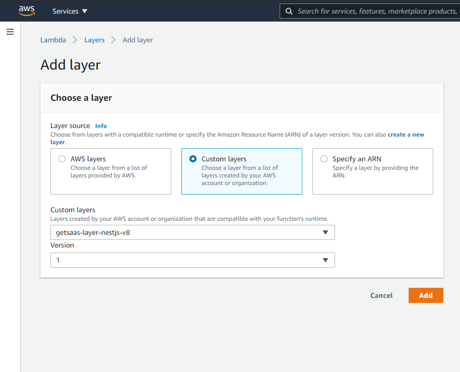

# getsaas-layer-node-data-utils

AWS Lambda utility layer for data manipulation in NodeJS

## Deploying to your AWS account

Coming soon

## Batteries included

Here's the list of packages provided by this layer:

| Package | Version | Why? |
|:--- |:--- |:--- |
| `mongoose` | `^5.12.4 ` | [MongoDB Support] |

> **TODO**
> &nbsp;
> Update table of packages

## Usage

### As a NodeJS dependency in your project

In your project directory:

`yarn add @getsaas/layer-node-data-utils`

or 

`npm i -S @getsaas/layer-node-data-utils`

Now when you build and deploy your lambda function, the `node_modules` directory will include all dependencies in the layer.

### As an AWS Lambda layer

In your project directory:

`yarn add -D @getsaas/layer-node-data-utils`

or 

`npm i -D @getsaas/layer-node-data-utils`

When you build your lambda function for deployment, make sure to only install `production` dependencies. Then:

1. Go to the details page for your AWS Lambda Function,
2. Click on Layers and then on `Add a layer`,
3. Select `Custom layers (Choose a layer from a list of layers created by your AWS account or organization.)` as the Layer source,
4. From the `Custom layers` dropdown list, select `getsaas-layer-node-data-utils` and select the appropriate layer version:

